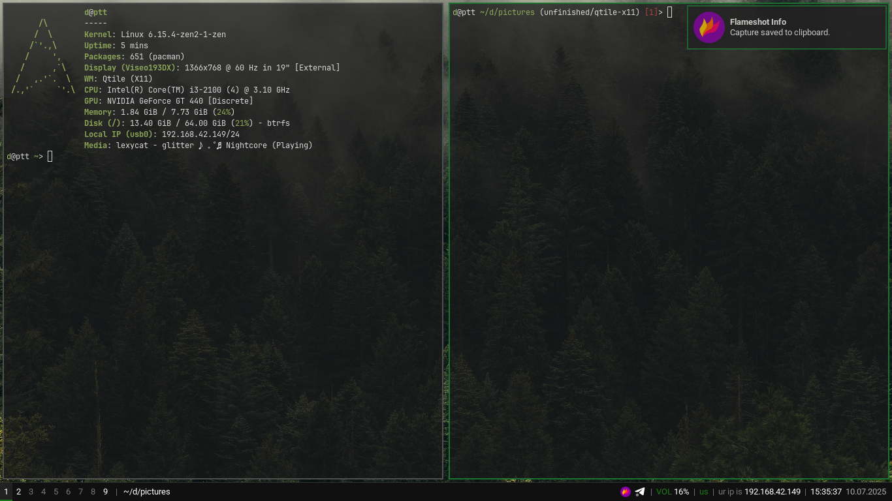
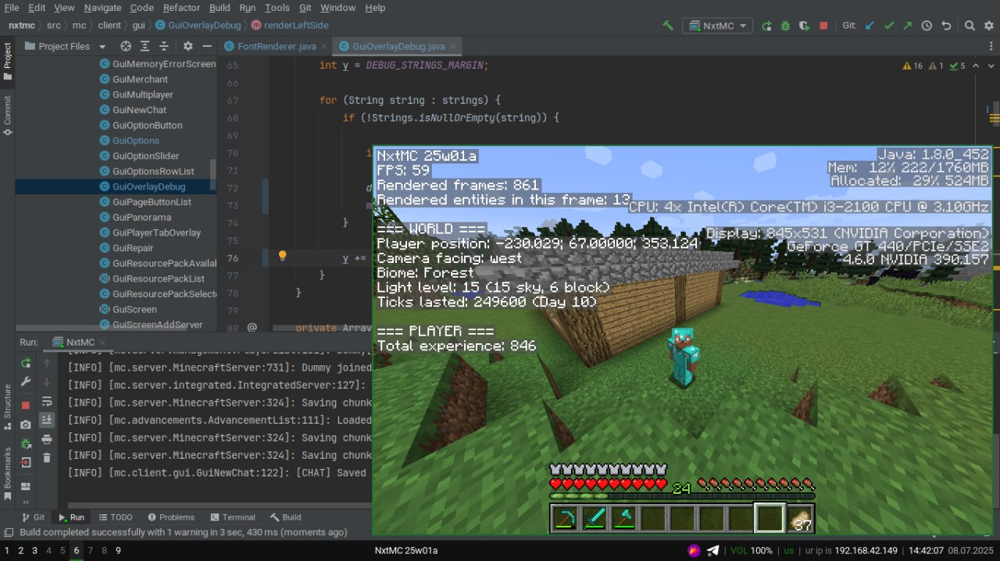

# dotfiles
unfinished dotfiles.

# used technologies
artix linux, x11, qtile, alacritty, dunst, polybar, picom, fastfetch, rofi

# screenshots

# progress
- [x] - wm
- [x] - compositor
- [x] - terminal
- [x] - notifications
- [x] - bar
- [x] - dconf stuff
- [x] - app launcher
- [ ] - obsidian
- [ ] - shell
- [ ] - browser
- [ ] - email client
- [ ] - password manager
- [ ] - vscode
- [ ] - backuping stuff
- [ ] - clipboard manager
- [ ] - mpd
- [ ] - add from youtube music
- [ ] - custom icon pack
- [ ] - custom xdg-open
- [ ] - dashboard
